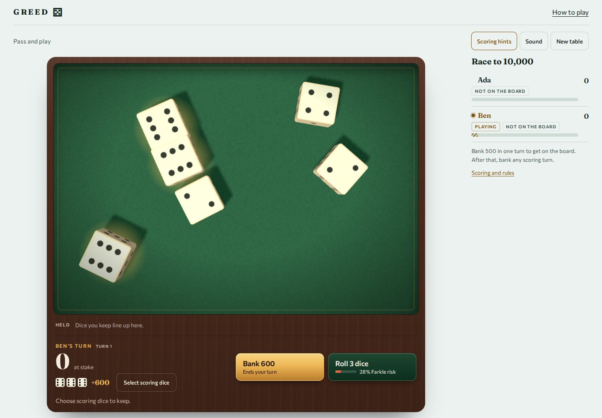
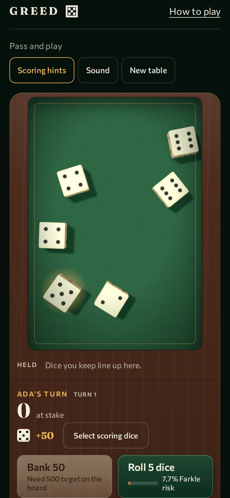

# Greed

**One more roll?** A dice game of nerve for two to eight players, also known as Farkle or
10,000. Real physics throws the dice, and every player sees the same throw. Play
pass-and-play on one screen, or in a private online room.

[](LICENSE)
[](https://nodejs.org/)
[](https://www.typescriptlang.org/)
[](https://vite.dev/)
[](https://threejs.org/)
[](https://rapier.rs/)
[](vendor/gyral/0.3.1-next.1/SOURCE.json)
[](https://nodejs.org/api/sqlite.html)
[](#testing-and-validation)
[](Dockerfile)
[](https://github.com/mikezupper/greed-game/commits/main)

<p align="center">
  
  
</p>

## Contents

- [The game](#the-game)
- [Features](#features)
- [Tech stack](#tech-stack)
- [Architecture](#architecture)
- [Project layout](#project-layout)
- [Getting started](#getting-started)
- [Configuration](#configuration)
- [Testing and validation](#testing-and-validation)
- [Conventions](#conventions)
- [Deployment](#deployment)
- [Status and limitations](#status-and-limitations)
- [License and credits](#license-and-credits)

## The game

On your turn you throw six dice and set aside at least one scoring die or combination.
Then you choose: **bank** the points you have built up this turn, or **roll** the dice you
did not keep. A throw with nothing that scores is a **Farkle**: you lose everything from
that turn. If every die scores, you have **hot dice** and may throw all six again.

| Dice | Points |
| --- | --- |
| Single 1 / single 5 | 100 / 50 |
| Three 1s | 1,000 |
| Three 2s–6s | face value × 100 |
| Four / five / six of a kind | 1,000 / 2,000 / 3,000 |
| Straight (1–6) or three distinct pairs | 1,500 |
| Two distinct triplets | 2,500 |

- **Opening roll.** Everyone throws one die; the highest starts and tied leaders throw again.
- **Getting on the board.** Your first bank must be at least 500 points from one turn.
- **Combinations come from one throw.** Dice from different throws never combine. Four 1s
  score 1,000 as a group, not a triplet plus a single.
- **Endgame.** When someone banks 10,000, every other player gets exactly one final turn.
  The highest score wins; tied leaders play equal-turn sudden-death rounds.

The full rules, including variants chosen while building, are in the
[rules specification](docs/product-specs/rules.md). The Roll button shows the chance
that the next throw scores nothing. That number is counted exactly through the scoring
rules: 2.3% with six dice, rising to 66.7% with one.

## Features

- **Pass-and-play** for two to eight named players. A local match saves in the browser
  and resumes after a reload.
- **Private online rooms.** Create a room, share the invite link and ready up; the host
  starts. Guests need no account. Late arrivals watch as spectators.
- **Server-authoritative dice.** Online, the server simulates every throw with Rapier and
  sends the recorded motion. Browsers replay it and never submit dice values.
- **Reconnects.** Reloading reclaims your seat. A newer tab takes over from an older one.
  Disconnected players have a 30-second grace period, and the host role moves to a
  connected player when needed.
- **Optional 60-second decision clock.** On timeout, points already kept are banked when
  legal; otherwise the turn is forfeited.
- **Lamp-lit card-room table.** Green felt, walnut frame and ivory 3D dice under an overhead
  camera, with Farkle, hot-dice, bank and victory moments.
- **Helpful, not pushy.** Optional scoring hints glow under dice that can score, and
  "Select scoring dice" picks the best selection.
- **Accessible.** Each die on the table is a real button for pointer, touch, keyboard and
  screen readers. Every control is at least 44px. The game supports light and dark themes,
  reduced motion and forced colors. The rules are plain HTML that works without JavaScript.
- **Optional sound**, off until a player turns it on.

## Tech stack

| Layer | Technology |
| --- | --- |
| Language | TypeScript 5.9, strict mode, run directly by Node 24 (type stripping) |
| UI components | [Gyral](vendor/gyral/0.3.1-next.1/SOURCE.json) 0.3.1-next.1: Model-View-Intent custom elements with pure reducers and effects as data |
| 3D graphics | Three.js 0.186 (WebGL), lazy-loaded |
| Physics | Rapier 3D 0.21 (WASM): a browser worker for local play, a Node worker for rooms |
| Server | Node 24 `http` plus `ws` 8 WebSockets, and Zod 4 validation for every message |
| Storage | `node:sqlite` with versioned schema, live backups and recovery of a pending roll |
| Build | Vite 8 with Brotli/gzip precompression and fingerprinted assets |
| Styling | Hand-written modern CSS: cascade layers, OKLCH tokens, `light-dark()`, container queries, logical properties |
| Fonts | Fraunces and Commissioner variable fonts, self-hosted ([provenance](docs/references/fonts.md)) |
| Tests | Vitest 4 (unit), Vitest browser mode in real Chromium, Playwright 1.63 and axe-core |
| Deployment | Multi-stage Docker image, Compose and a Caddy template for HTTPS/WSS |

## Architecture

Greed has one pure turn engine and two runtime adapters. Local play runs the physics in
a browser worker. Online play runs it in a Node worker beside the room server, which is
the only authority for online turns, scores and dice.

```text
Gyral UI ──actions──▶ local session ──▶ browser worker ──▶ Rapier
   ▲                    OR
   │                  remote session ══WebSocket══▶ Room ──▶ SQLite
   │                                                  │
   │                                                  └──▶ Node worker ──▶ Rapier
   └──── snapshots (table state + recorded throw) ◀───┘
          └──▶ <dice-tray>: Three.js replays the recorded frames
```

**The pure engine** (`src/game`) holds scoring, turns, the match lifecycle and Farkle
odds. It uses no randomness, clocks, DOM, storage, network or physics. Every move is a
function from table to table, or a refusal with a reason.

**An online throw** works like this:

1. The browser sends `Act` with a unique action ID, the revision it saw, and the move. A
   Bank or Roll can carry the dice to keep, so keeping and deciding is one transition.
2. The room drops duplicate action IDs and rejects stale revisions with a fresh
   snapshot. It checks the move against the pure engine.
3. A roll records its launch seed and the previous state, **saves to SQLite, and only then
   broadcasts**. Physics runs in a worker outside the transition.
4. The room accepts the result only if the revision has not moved on. It saves the outcome
   and recorded frames, then broadcasts. If the worker fails, retrying replays the same
   launch; it never draws a new outcome.
5. Every client replays the same frames, capped at four seconds. Controls unlock when the
   dice settle, and the optional decision clock starts after playback.

**The UI** is one Gyral component, `<greed-table>`, with three screens chosen from the
snapshot: start, waiting room and table. Reducers are pure. Sockets, workers, timers,
storage and the clipboard are reached through commands and drivers. The reducer notices
moments (bank, Farkle, hot dice) by comparing consecutive snapshots.

**The 3D tray** (`<dice-tray>`) owns its WebGL context, an overhead camera that fits the
physical arena to the felt, and real HTML buttons placed over each die from the camera
projection. Disconnecting it releases the renderer, geometry, materials, shadows,
observers and listeners.

Layer boundaries are enforced by `scripts/check-repo.ts`:

| Layer | May import | External dependencies |
| --- | --- | --- |
| `game` | game | none |
| `physics` | physics, game | Rapier |
| `protocol` | protocol, game, physics | Zod |
| `server` | server, game, protocol, physics | Node, ws, Zod |
| `state` | state, game, protocol, physics | browser APIs |
| `app` | app, state, game, protocol | Gyral |
| `rendering` | rendering, physics, game | Three.js |

The full write-up is in [ARCHITECTURE.md](ARCHITECTURE.md). The physics write-up is in
[docs/design-docs/physics.md](docs/design-docs/physics.md).

## Project layout

```text
.
├── index.html               Static page: intro, rules, scoring and odds tables (no JS needed)
├── src/
│   ├── game/                Pure rules: scoring, turns, match lifecycle, Farkle odds
│   ├── physics/             Rapier simulation, seeded randomness, face reading, workers
│   ├── protocol/            Zod schemas for every client and server message
│   ├── server/              HTTP + WebSocket server, rooms, SQLite, physics pool
│   ├── state/               Local and remote sessions behind one interface
│   ├── app/                 Gyral UI: model, screens, table view, score lanes, drivers
│   ├── rendering/           <dice-tray>: Three.js scene, dice, buttons over the dice
│   └── styles/              main.css and self-hosted fonts
├── tests/                   Unit tests and real-browser component tests
├── scripts/                 Repository checks, validation drivers, backup, compression
├── docs/                    Specs, design docs, plans, quality score, generated evidence
├── vendor/gyral/            Pinned Gyral release tarballs with checksums
├── deploy/Caddyfile         HTTPS/WSS reverse-proxy template
├── Dockerfile, compose.yml  Production container
└── AGENTS.md                Map and invariants for coding agents
```

## Getting started

**Prerequisites:** Node.js **24.15 or newer within 24.x** (see `.nvmrc`) and npm. Docker is
optional. Every dependency installs from the lockfile; Gyral comes from the vendored
tarballs, so no sibling checkout is needed.

```sh
git clone https://github.com/mikezupper/greed-game.git
cd greed-game
npm ci
```

### Develop

Run the room server and the Vite client in two terminals:

```sh
npm run dev:server   # room server on http://127.0.0.1:8787 (restarts on change)
npm run dev          # client on http://127.0.0.1:5173 (proxies /api and /ws to 8787)
```

Open <http://127.0.0.1:5173>. Pass-and-play works without the room server; online rooms
need it.

### Production build

```sh
npm run build        # Vite build plus Brotli/gzip copies into dist/
npm start            # serves dist/ and the game server on http://127.0.0.1:8787
```

### Docker

```sh
docker build -t greed-dice-game .
docker compose up -d --build     # app on 127.0.0.1:8787, data in the greed-data volume
```

The Compose service runs as UID 1000 with a read-only root filesystem, a named data
volume, CPU, memory and process limits, rotated logs and a health check on `/healthz`.

## Configuration

The server reads `.env` when present; variables already set in the environment win.
Copy `.env.example` to start.

| Variable | Default | Purpose |
| --- | --- | --- |
| `PORT` | `8787` | HTTP and WebSocket port |
| `HOST` | `127.0.0.1` | Bind address. The Docker image sets `0.0.0.0` and Compose publishes on host loopback |
| `DATA_DIR` | `.data` | Directory for `greed.sqlite` |
| `STATIC_DIR` | `dist` | Built client files to serve |
| `PUBLIC_ORIGIN` | *(unset)* | Exact public HTTPS origin, e.g. `https://greed.example.com`. Enables canonical and Open Graph URLs, `/sitemap.xml` and `/robots.txt`. Without it, the sitemap returns 503 rather than publish a made-up URL |
| `TRUSTED_PROXY` | *(unset)* | Exact IP address of your reverse proxy as Node sees it. Only that peer's forwarded address is trusted, for room-creation rate limits |
| `GAME_DOMAIN` | *(unset)* | Used by `deploy/Caddyfile`: the domain Caddy serves and gets certificates for |

Built-in limits, not configurable through the environment:
- Up to 256 live rooms, and 20 new rooms per client address per hour.
- Two to eight players per room.
- Rolls are simulated for at most 1,800 physics steps, with at most 16 queued rolls.
- Empty rooms are unloaded after 5 minutes; inactive rooms are deleted after 24 hours.
- Disconnect grace is 30 seconds; the optional decision clock is 60 seconds.

## Testing and validation

Install the browser once with `npx playwright install chromium`.

| Command | What it checks |
| --- | --- |
| `npm run check` | Layer boundaries, doc links and vendor checksums; strict types; ESLint with Gyral template rules; unit and real-browser tests; the production build |
| `npm test` | All Vitest projects (unit and Chromium browser) |
| `npm run validate:ui` | Built app in four setups (desktop light, 390px dark with motion, 320px, 200% text): keyboard start and dice, 44px targets, overflow, axe WCAG 2.2 AA, saved-game restore |
| `npm run validate:online` | Two real Chromium clients play a full 10,000-point match: shared throws, reconnect, rematch |
| `npm run validate:load` | Several rooms throwing at once |
| `npm run validate:physics -- 1000` | A seeded diagnostic of 6,000 throws: settling, face distribution, cost and payload size |
| `npm run validate:container` | The `greed-dice-game` Docker image (build it first): a guest roll, a backup, and a restart that keeps the data |

Each validation writes a JSON report to [docs/generated](docs/generated/README.md), and
screenshots go to `.artifacts/`. The [quality score](docs/QUALITY_SCORE.md) grades each
area against that evidence. The [validation notes](docs/design-docs/validation.md)
describe what each check covers and what it doesn't.

CI is a manual workflow (`.github/workflows/check.yml`) for a self-hosted runner. It runs
the check, the online match, UI and load validation.

## Conventions

These rules come from [AGENTS.md](AGENTS.md) and are enforced by checks where possible:

1. **`src/game` is pure.** No randomness, clocks, DOM, storage, physics, network or UI.
2. **The server is authoritative online.** Browsers send moves, never dice values.
3. **Save before broadcasting.** Deduplicate action IDs and reject stale revisions.
4. **Physics runs outside the transition.** Compare the revision before accepting a result.
5. **Gyral reducers, views and `init` are pure.** Effects are commands. Views name intents
   with `data-intent`; they never attach event closures.
6. **Three.js lives in `src/rendering`, Rapier in `src/physics`.**
7. **Disconnecting releases everything:** workers, subscriptions, sockets and graphics.
8. **Change the product spec before changing a rule**, and test the behavior that matters.
9. **Test in real browsers, never jsdom.** Keep semantic controls and reduced-motion support.
10. **Keep guidance local and indexed.** Update the quality report and plans with evidence.

Code style:
- **TypeScript:** strict mode, no build step for the server, and files under 300 lines (enforced).
- **CSS:** ordered cascade layers, OKLCH design tokens, logical properties, container
  queries, `prefers-reduced-motion`, `prefers-contrast` and `forced-colors` support. The
  table palette (felt, walnut, ivory, brass, oxblood) stays constant across themes.
- **HTML and accessibility:** native buttons, labelled fields, tables with captions and
  scoped headers, `<output>` for computed scores, polite status messages, and 44px
  minimum targets. Rules stay in static HTML.
- **Writing:** plain explanatory copy for players, and documentation that says what has
  been verified and what is still intended.
- **Dependencies:** pinned exactly. Vendored release files keep their checksums and are
  never upgraded silently.

Project-local skills for Gyral, modern CSS, semantic HTML, SEO and writing live under
[`.agents/skills`](.agents/skills), with [provenance](docs/references/skills-provenance.json).
Start with the [documentation index](docs/index.md).

## Deployment

Greed runs as **one Node service behind an HTTPS reverse proxy**, with SQLite on a
persistent volume. The outline:

1. Point a domain at a host with Docker, and set `PUBLIC_ORIGIN` (and `TRUSTED_PROXY` if
   needed) in `.env`.
2. Run `docker compose up -d --build`.
3. Serve it through Caddy using [`deploy/Caddyfile`](deploy/Caddyfile) with `GAME_DOMAIN`
   set. Caddy handles certificates and WebSocket upgrades.
4. Check `/healthz`, then play a full match from two devices, including a reload.
5. Schedule backups. They use a consistent native SQLite copy and are safe while the
   server runs:

   ```sh
   docker compose exec greed node scripts/backup.ts /app/.data/greed.sqlite /app/.data/backup-YYYY-MM-DD.sqlite
   ```

Restore steps, proxy details and operations notes are in [docs/DEPLOY.md](docs/DEPLOY.md).
Pre-launch gates are in the [release plan](docs/exec-plans/active/release.md).

## Status and limitations

The game is feature-complete and validated locally. It is not yet deployed publicly.
Known gaps, tracked in the [debt tracker](docs/exec-plans/tech-debt-tracker.md):

- **Chromium only so far.** Firefox, Safari, real mobile GPUs and a manual screen-reader
  pass are still to do.
- **Fairness evidence is statistical.** Physical dice fairness rests on large seeded
  samples, not a proof.
- **Capacity is a sample, not a guarantee.** It is measured as an eight-room burst on one
  machine; sustained load on a production host is untested.
- **Downloads are large.** The local physics worker and Three.js chunk are significant on
  slow networks, though both load lazily and are precompressed.
- **Held dice aren't grouped.** The rail does not yet group held dice by the throw they
  came from.

## License and credits

Greed is released under the [MIT License](LICENSE). Copyright © 2026 Mike Zupper.

Third-party components keep their own licenses:

- [Gyral](vendor/gyral/0.3.1-next.1/SOURCE.json): MIT, vendored as release tarballs
- [Three.js](https://threejs.org/): MIT
- [Rapier](https://rapier.rs/) (`@dimforge/rapier3d-compat`): Apache-2.0
- [ws](https://github.com/websockets/ws): MIT; [Zod](https://zod.dev/): MIT
- [Fraunces](https://github.com/undercasetype/Fraunces) and
  [Commissioner](https://github.com/kosbarts/Commissioner): SIL Open Font License 1.1,
  with license texts in `src/styles/fonts/`
